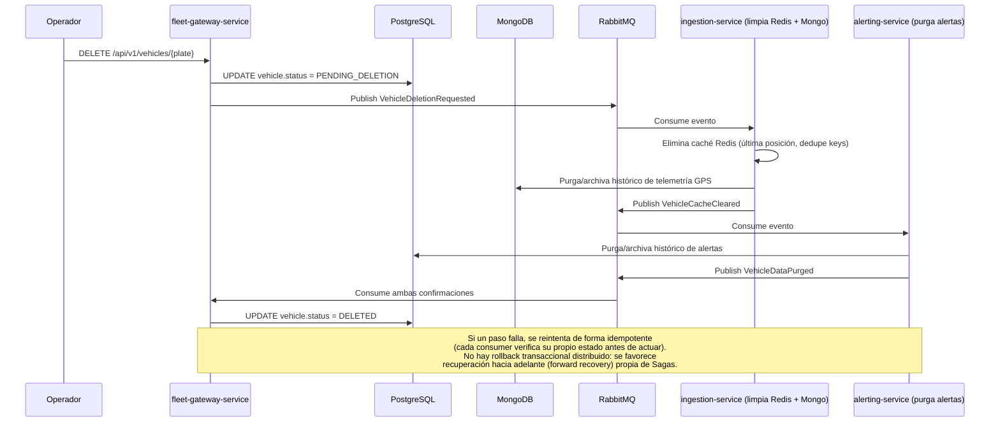
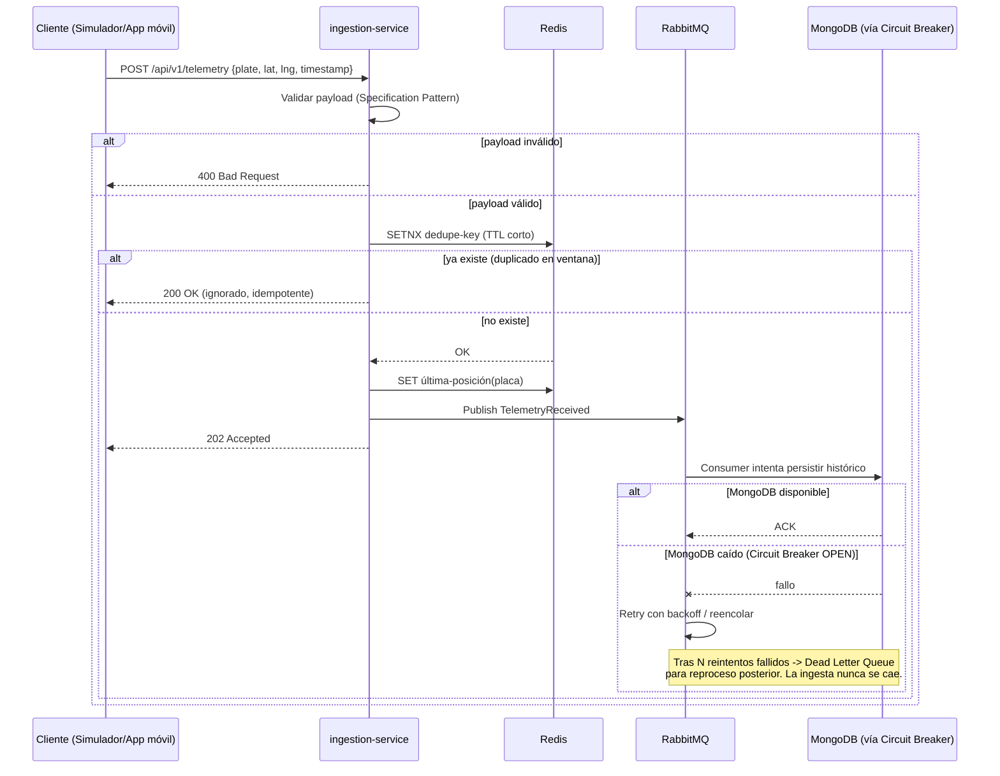
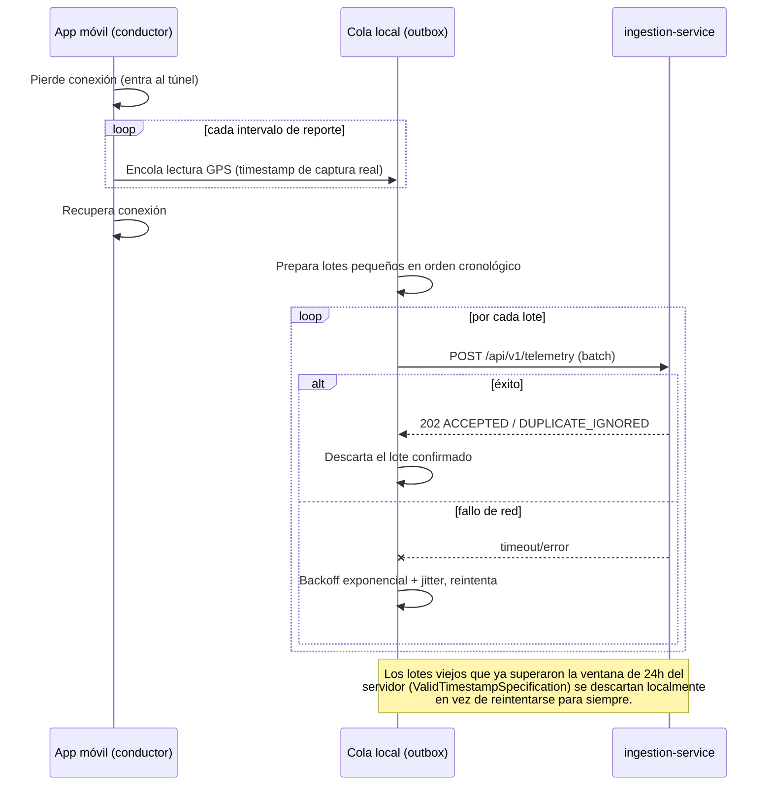

# Sistema de Monitoreo y Telemetría de Flotas

Prototipo funcional de un sistema de telemetría GPS para flotas: ingesta de coordenadas,
detección de anomalías/alertas, dashboard web en tiempo real y app móvil para conductores con
cola offline-first.

## Arquitectura seleccionada y por qué

3 microservicios backend independientes, comunicados de forma asíncrona vía RabbitMQ, cada
uno con arquitectura hexagonal interna (dominio aislado de Spring/JPA/AMQP/Redis):

- **`ingestion-service`**: Recibe coordenadas GPS, valida (Specification Pattern), deduplica
  y cachea en Redis, publica evento y persiste en MongoDB protegido por Circuit Breaker. También
  recibe la activación del **botón de pánico** de la app móvil (`POST /api/v1/panic`), una
  tubería paralela a la de telemetría que no depende de coordenadas. Además expone
  `GET /api/v1/telemetry/{plate}/history` para **trazar la ruta** de un vehículo: lee
  directamente el histórico ya persistido en MongoDB (sin pasar por eventos ni por
  fleet-gateway-service), y lo devuelve en orden cronológico listo para dibujarse como polyline.
- **`alerting-service`**: Consume eventos de telemetría y detecta vehículos detenidos
  (Strategy Pattern extensible a más reglas), y suprime esa alerta cuando el vehículo está
  detenido dentro de una **zona segura** conocida (ej. un parqueadero). También genera una
  alerta `PANIC_BUTTON` inmediata cuando consume un evento de botón de pánico, reutilizando la
  misma persistencia y publicación de alertas que las reglas de telemetría, sin pasar por ellas.
- **`fleet-gateway-service`**: Registro de vehículos, **orquestador del Saga de eliminación**,
  **vista de lectura del dashboard** y **push en tiempo real por WebSocket/STOMP**:
  `POST /api/v1/vehicles`, `DELETE /api/v1/vehicles/{plate}`, `GET /api/v1/vehicles/{plate}` y
  `GET /api/v1/vehicles` (listado de vehículos activos con su último estado: `EN_MOVIMIENTO`,
  `DETENIDO`, `ALERTA`). Esta vista se mantiene al día suscribiéndose a `fleet.telemetry` y
  `fleet.alerts`: los mismos eventos que ya publicaban ingestion-service y alerting-service,
  sin tocar sus bases de datos ni su código (ver "Notas de diseño"). Cada cambio de estado
  (nueva posición, nueva alerta, o el vehículo finalmente eliminado por el Saga) se empuja
  además por WebSocket/STOMP hacia el dashboard (`/topic/fleet`, `/topic/alerts`), sin que el
  cliente tenga que hacer polling. También mantiene su propio historial reciente de alertas
  (`GET /api/v1/alerts`), para que el dashboard no dependa únicamente del push en vivo al
  abrir o recargar la página.
- **`contracts`**: no es un microservicio: es una librería compartida (sin `main()`, sin
  puertos propios) con los **records** que definen el *wire format* de los eventos de
  RabbitMQ (`TelemetryReceivedEvent`, `VehicleAlertRaisedEvent`, `PanicButtonPressedEvent`,
  `VehicleDeletionRequestedEvent`, `VehicleCacheClearedEvent`, `VehicleDataPurgedEvent`). Los
  tres microservicios dependen de este módulo en tiempo de compilación para publicar y
  consumir exactamente la misma forma de mensaje, sin duplicar el DTO en cada servicio. No
  contiene lógica de negocio (ver "Notas de diseño" sobre por qué no comparte dominio).

El **dashboard web** (`/frontend`, Angular 18 standalone components) consume `fleet-gateway-
service`: mapa en vivo (Leaflet) con la posición y el estado de cada vehículo, listado con alta/
borrado y panel de alertas, todo actualizado en tiempo real por WebSocket/STOMP sin polling. Su
propio catálogo de patrones de diseño y su estructura de carpetas están documentados más abajo.

### Diagrama de contenedores (C4 - Nivel 2)


### Por qué microservicios + Hexagonal + CQRS "en espíritu" (frente a las alternativas)

**Microservicios en vez de un monolito.** `ingestion-service` recibe una escritura por cada
lectura GPS de toda la flota, el patrón de carga más alto del sistema, muy por encima de
`alerting-service` (que solo evalúa reglas) o `fleet-gateway-service` (que atiende un dashboard
con tráfico de lectura). Un monolito acoplaría el escalado de los tres: para soportar más
vehículos habría que escalar también las partes que no lo necesitan. Separarlos en servicios
independientes, cada uno dueño de su propio bounded context y su propia base de datos primaria,
permite escalar horizontalmente solo la pieza que realmente lo necesita (el mismo razonamiento
detrás de la persistencia poliglota, ver "Notas de diseño"), a costa de una complejidad
operativa real: coordinar despliegues, red entre servicios y consistencia eventual en vez de
transacciones ACID de punta a punta. Para el volumen y el alcance de este prototipo esa
complejidad es manejable y queda demostrada end-to-end; en un sistema mucho más pequeño no se
justificaría.

**Hexagonal (Ports & Adapters) en vez de Clean Architecture con capas nombradas.** Ambas
comparten la misma regla de dependencia, el dominio no conoce el framework, el framework
depende del dominio, pero se adoptó Hexagonal por su vocabulario más directo para un servicio
que habla con varias piezas de infraestructura a la vez (JPA, MongoDB, Redis, AMQP, WebSocket):
separar explícitamente `domain.port.in` (quién llama al dominio) de `domain.port.out` (a quién
llama el dominio) hace que una regla como "`infrastructure` nunca depende de `application`
directamente" sea verificable con solo mirar los imports, sin necesitar la taxonomía de capas
concéntricas (Entities/Use Cases/Interface Adapters) de Clean Architecture para llegar al mismo
resultado.

**CQRS "en espíritu", no un framework CQRS completo.** El camino de escritura
(`ingestion-service`) está físicamente separado del modelo de lectura agregado
(`fleet-gateway-service`), pero sin event sourcing ni múltiples read models: la vista de
`vehicles` se mantiene al día suscribiéndose a los eventos que ingestion-service y
alerting-service ya publicaban, en vez de consolidar las tres bases de datos o exponer llamadas
síncronas entre servicios (API Composition, evitada a propósito para no meter una dependencia
síncrona en el camino de lectura). Ir al CQRS completo habría sido sobre-ingeniería para un
prototipo de esta escala.

### Secuencia: Saga de eliminación de vehículo (coreografía, consistencia eventual)



## Decisiones técnicas

Por qué cada pieza del stack, no solo cuál, la razón detrás de cada base de datos, framework y
mecanismo de resiliencia elegido:

| Capa | Tecnología | Por qué |
|---|---|---|
| Backend | Java 21 + Spring Boot 3.3 | El stack que domino con mayor profundidad, con arquitectura orientada a servicios |
| Arquitectura backend | Hexagonal (Ports & Adapters) + DDD ligero por bounded context | Aísla las reglas de negocio de Spring/JPA/AMQP/Redis; facilita testing y evolución independiente por servicio |
| Persistencia (transaccional) | PostgreSQL 16 (JPA/Hibernate) | Vehículos, alertas y estado del Saga de eliminación: necesitan transaccionalidad, relaciones y estados consistentes |
| Persistencia (telemetría GPS) | MongoDB 7 (colección *time-series* + índice `2dsphere`) | Histórico de coordenadas: escritura muy alta, append-only, sin joins, con consultas por placa+rango de tiempo y geoespaciales, encaja mejor que un modelo relacional (persistencia poliglota) |
| Caché | Redis 7 | Última posición conocida + dedupe de coordenadas, con TTL corto |
| Mensajería | RabbitMQ 3 (topic exchanges) | Desacopla Ingesta ↔ Alertas; permite encolar ante fallos de BD sin tumbar la ingesta |
| Resiliencia | Resilience4j (Circuit Breaker + Retry) | Estándar del ecosistema Spring Boot para tolerancia a fallos |
| Tiempo real | WebSocket + STOMP | Push del servidor al dashboard (y a futuro, a la app móvil) sin polling |
| Validación | Bean Validation + Specification Pattern | Reglas de negocio de validación de payload GPS, composables y testeables de forma aislada |
| Build backend | Maven multi-módulo (monorepo) | Un solo repositorio, módulos independientes por servicio + módulo `contracts` compartido |
| Testing backend | JUnit5 + Mockito | Pruebas unitarias de reglas de negocio críticas. |
| Frontend | Angular 18 (standalone components) + TypeScript | El framework frontend que mejor domino (Angular, Angular Material, PrimeNG) |
| Mapa | Leaflet (ngx-leaflet) | Gratuito, sin API key |
| Cliente realtime | `@stomp/stompjs` + `sockjs-client` | Consistente con STOMP en el backend |
| Móvil | Flutter 3.44.4 (Dart 3.12.2) | Permite un prototipo funcional real (no mockups) para el conductor |
| Simulador de telemetría | Python (script standalone, `asyncio` + `httpx`) | Componente desacoplado (solo habla HTTP/JSON con el backend, no comparte tipos con nada más); experiencia reciente propia con scripting en Python |
| Infraestructura | Docker + Docker Compose | Un solo comando (`docker compose up -d --build`) para levantar todo el entorno |
| CI/CD | GitHub Actions | Build + test de backend y frontend, análisis estático y build de imágenes Docker |

Las decisiones más relevantes (por qué RabbitMQ y no un patrón Outbox, por qué WebSocket y
no SSE, por qué persistencia poliglota, etc.) están documentadas en
[Notas de diseño](#notas-de-diseño-trade-offs) más abajo; por qué Hexagonal y por qué CQRS "en
espíritu" se explican en
[Arquitectura seleccionada y por qué](#arquitectura-seleccionada-y-por-qué).

## Patrones de diseño aplicados

### Patrones GoF (Gang of Four)

- **Adapter**: Cada adaptador de infraestructura (repositorio JPA, driver de MongoDB, cliente Redis, publisher/consumer de AMQP, endpoint WebSocket) traduce el mundo exterior a los puertos que define el dominio; es la base misma de la arquitectura hexagonal.
- **Strategy**: Reglas de alerta intercambiables detrás de una interfaz común `AlertRule` (vehículo detenido; a futuro: exceso de velocidad, etc.), sin tocar el motor que las ejecuta.
- **Chain of Responsibility**: La validación del payload GPS es una cadena de validadores (rango de coordenadas → timestamp → no-duplicado); cada eslabón decide continuar o cortar la cadena, y se apoya en el Specification Pattern para expresar cada regla.
- **Decorator** Resilience4j envuelve (decora) las llamadas a los puertos de persistencia con Circuit Breaker + Retry de forma transparente, sin modificar el adaptador original. `SafeZoneAwareAlertRule` aplica el mismo patrón sobre `AlertRule`: envuelve a `StoppedVehicleRule` para suprimir su alerta cuando el vehículo está dentro de una zona segura, sin modificar la regla decorada.
- **Observer**: La publicación de eventos de dominio en RabbitMQ y el broadcast WebSocket/STOMP a los clientes suscritos son, en esencia, Observer aplicado a nivel distribuido (productores que no conocen a sus consumidores).
- **Facade**: `fleet-gateway-service` actúa como fachada (BFF) que le simplifica al frontend el acceso a múltiples subsistemas (Postgres, y los eventos que produce Mongo/Redis a través de los otros servicios).
- **State**: El estado del vehículo (`EN_MOVIMIENTO`, `DETENIDO`, `ALERTA`, `PENDING_DELETION`, `DELETED`) se modela como una máquina de estados explícita con transiciones válidas, no como un enum suelto con `if/else` dispersos.
- **Builder**: Construcción de objetos de dominio con varios campos opcionales (ej. `Alert`, `TelemetryEvent`) de forma legible y sin depender del orden de los argumentos.

### Otros patrones (DDD / arquitectura distribuida)

- **Hexagonal / Ports & Adapters** por servicio, dominio sin dependencias de Spring/JPA/AMQP/Redis, testeable con JUnit puro.
- **Specification Pattern**, validación de payload GPS (coordenadas válidas, timestamp válido, no-duplicado), reglas composables y testeables por separado.
- **Circuit Breaker + Retry (Resilience4j)**, protege la escritura a MongoDB (histórico de telemetría); si falla, el mensaje se reintenta/reencola sin tumbar la ingesta.
- **Saga coreografiada**, eliminación de vehículo con consistencia eventual entre Redis, MongoDB y PostgreSQL (ver diagrama de secuencia arriba).
- **Repository Pattern**, puertos de persistencia en el dominio, implementados por adaptadores JPA (Postgres) y del driver de MongoDB (telemetría), intercambiables sin tocar el dominio.
- **Idempotent Consumer**, los consumers de RabbitMQ verifican su propio estado antes de actuar, para tolerar reintentos y entregas duplicadas (at-least-once delivery).
- **CQRS "en espíritu"**, el camino de escritura (`ingestion-service`) está físicamente separado del modelo de lectura agregado (`fleet-gateway-service`), sin implementar un framework CQRS completo (event sourcing, múltiples read models), decisión consciente de alcance para este prototipo.

### Frontend (Angular)

El dashboard aplica su propio catálogo, análogo al del backend pero con sus propios nombres:

- **Adapter**: `StompClientAdapter` (`core/realtime`) envuelve `@stomp/stompjs` +
  `sockjs-client` detrás de la interfaz propia `RealtimeClientPort`; ningún componente conoce
  la librería concreta de tiempo real.
- **Repository**: `VehicleApiService` (`core/http`) envuelve `HttpClient` contra
  `/api/v1/vehicles` y expone operaciones de dominio (`list/register/remove`), análogo al
  `VehicleRepositoryPort` del backend.
- **Facade**: `FleetStoreService` (`core/store`) combina el Repository y el Adapter de tiempo
  real detrás de Angular Signals de solo lectura; ningún componente de presentación depende de
  HTTP ni de STOMP directamente.
- **Strategy**: `movement-status.presentation.ts` y `vehicle-status.presentation.ts`
  (`shared/strategies`) traducen `movement_status`/`status` a ícono + etiqueta + color; agregar
  un estado nuevo solo extiende el mapa, sin tocar los componentes que lo consumen.
- **Builder**: `MarkerBuilder` (`features/fleet-dashboard/map`) construye y actualiza los
  marcadores de Leaflet paso a paso, sin exponer su API al componente de mapa. `RouteLineBuilder`
  aplica el mismo patrón para la polyline de ruta del vehículo seleccionado.
- **Decorator**: `apiErrorInterceptor` (`core/http`) decora cada respuesta de error HTTP,
  traduciendo el cuerpo `{timestamp, status, error}` del backend a un `ApiError` tipado.
- **Observer**: Los `computed`/`effect` de Signals y los `Observable` de `HttpClient`/STOMP son,
  en esencia, el mismo patrón que ya aplica el backend a nivel distribuido.
- **Singleton**: Todos los servicios de `core/` están `providedIn: 'root'`.

## Tolerancia a fallos

Este prototipo asume que cualquier pieza de infraestructura puede fallar, una caída de MongoDB,
un timeout de red, un payload malformado, y está diseñado para no tumbar la ingesta cuando eso
pasa.

### Validación de datos: Specification Pattern + Chain of Responsibility

Cada lectura GPS pasa por una cadena de validadores antes de aceptarse: rango de coordenadas
válido → timestamp dentro de la ventana `[-24h, +1min]` → no-duplicado (dedupe por Redis). Cada
eslabón es una `Specification` independiente y testeable por separado; el primero que falla
corta la cadena y responde `400` sin evaluar el resto (`TelemetryValidationChainTest` lo
confirma explícitamente). Esto evita que la regla de negocio termine en un método gigante con
`if/else` anidados, y permite agregar una validación nueva sin tocar las existentes.

### Reintentos y Circuit Breaker (Resilience4j)

La escritura del histórico de telemetría a MongoDB está protegida por Retry + Circuit Breaker:
si Mongo falla, el mensaje se reintenta con backoff y, tras agotar los reintentos, se reencola
para reproceso posterior en una Dead Letter Queue en vez de perderse o bloquear la ingesta. El
Circuit Breaker evita que los reintentos contra un Mongo caído se sigan acumulando
indefinidamente: al abrirse, deja de intentar la operación protegida hasta que el recurso se
recupera. Los consumers de RabbitMQ, además, son idempotentes, verifican su propio estado antes
de actuar, para tolerar reintentos y entregas duplicadas (*at-least-once delivery*) sin efectos
secundarios repetidos.

### Secuencia: ingesta happy-path + Circuit Breaker abierto



### Por qué no 2PC/XA entre Postgres, Redis y RabbitMQ

Un commit transaccional distribuido entre estos tres recursos heterogéneos añadiría acoplamiento
y latencia. Se prefieren mensajes idempotentes + reintentos (at-least-once) sobre exactly-once
transaccional, el mismo principio del Circuit Breaker de arriba, extendido a nivel de mensajería.

> El Saga de eliminación de vehículo (consistencia eventual entre Redis, MongoDB y PostgreSQL) se
> documenta en [Arquitectura seleccionada y por qué](#arquitectura-seleccionada-y-por-qué), por
> tratarse de consistencia distribuida entre servicios y no de tolerancia a fallos de
> infraestructura.

## Estructura del repositorio

```
/backend
  pom.xml                   Parent Maven (groupId com.simon.fleet), importa el BOM de Spring Boot
  /contracts                DTOs de eventos compartidos (wire format, sin lógica de dominio)
  /ingestion-service        domain(model,validation,port.in,port.out) / application / infrastructure, Dockerfile propio
  /alerting-service         domain(model,rule,port.in,port.out) / application / infrastructure, Dockerfile propio
  /fleet-gateway-service    domain(model,port.in,port.out) / application / infrastructure, registro de vehículos, orquestador del Saga, vista de lectura del dashboard y push WebSocket/STOMP, Dockerfile propio
/frontend
  Dockerfile                Build de producción (Angular -> nginx)
  src/app/core              Servicios transversales: HTTP (Repository), realtime (Adapter STOMP), store (Facade), modelos, config
  src/app/shared            Componentes/pipes reutilizables: status-badge, connection-indicator, confirm-dialog, strategies de presentación
  src/app/features/fleet-dashboard  Header, mapa (Leaflet), lista de vehículos y panel de alertas
/mobile                     App móvil del conductor (Flutter): onboarding, viaje con reporte periódico, botón de pánico, historial de alertas, cola offline-first (sqflite)
/simulator
  Dockerfile
                            Script de simulación de telemetría + inyección de caos (Python)
/.github/workflows/ci.yml   CI: tests backend (JUnit5/Mockito) + análisis SonarCloud, build de frontend, build de las imágenes Docker de los 3 microservicios + frontend + simulador
docker-compose.yml          Orquesta Postgres/Mongo/Redis/RabbitMQ + los 3 microservicios + frontend en un solo comando; el simulador va tras --profile simulator
```

Cada microservicio sigue el mismo esqueleto hexagonal, sin frameworks en `domain`, el
cableado de Spring (beans, `@Value`, Clock) vive en `infrastructure.config`:

- **`domain.model`**: Entidades y value objects (ej. `VehiclePlate`, `Coordinates`), incluidos
  los enums de estado (`VehicleStatus`, `MovementStatus`): son conceptos de dominio igual que
  un value object, no un misfit.
- **`domain.exception`**: Excepciones de dominio (ej. `VehicleNotFoundException`), separadas
  de `domain.model` porque son control de flujo/error, no "objetos del negocio".
- **`domain.port.in`**: Puertos de entrada (*driving*): una interfaz *UseCase* por cada
  operación que el núcleo ofrece hacia afuera (ej. `IngestTelemetryUseCase`). Los adaptadores
  primarios (`TelemetryController`, un `@RabbitListener`) dependen de estas interfaces, nunca
  de su implementación concreta.
- **`domain.port.out`**: Puertos de salida (*driven*): una interfaz por cada cosa que el
  núcleo necesita del mundo exterior (ej. `TelemetryHistoryRepositoryPort`). Los adaptadores
  secundarios (`MongoTelemetryHistoryRepository`, `RedisTelemetryCacheAdapter`) las implementan.
- **`application`**: Solo las clases `*Service` que implementan los `port.in` y orquestan
  llamadas a los `port.out`; ningún contrato (interfaz) vive aquí, solo orquestación.
- **`infrastructure`**: Adaptadores, organizados por rol técnico dentro de cada tecnología:
  - `web.{controller,dto,mapper,exception}`, controladores REST, DTOs de request/response,
    mappers DTO↔dominio y el `@RestControllerAdvice` global, cada uno en su propio subpaquete.
  - `persistence.<mongo|postgres>.{entity,repository,adapter,config}`, entidades
    JPA/`@Document`, repositorios Spring Data, adaptadores que implementan `port.out`, y
    configuración específica de esa tecnología (ej. `MongoIndexConfig`).
  - `messaging.rabbitmq.{config,publisher,consumer}`, topología de exchanges/colas/DLQ,
    adaptadores que publican eventos, y `@RabbitListener` que los consumen.
  - `cache.redis`, adaptadores de Redis (sin subdividir: solo 2-3 archivos por servicio).
  - `config`, beans de Spring transversales, no atados a una tecnología (`CorsConfig`,
    `ClockConfig`, `OpenApiConfig`).

`port.in` y `port.out` viven ambos bajo `domain` (no bajo `application`) porque son la misma
clase de cosa, una interfaz en el borde del hexágono, solo que en direcciones opuestas;
separarlos de sus implementaciones (`application` para los casos de uso, `infrastructure` para
los adaptadores) es lo que hace que una regla tipo "`infrastructure` nunca depende de
`application` directamente" sea verificable con solo mirar los imports.

## Principios de calidad de código

- **SOLID**
  - **S, Single Responsibility:** Cada clase de dominio/caso de uso tiene una única razón de cambio (ej. `StoppedVehicleRule` solo decide si un vehículo está detenido; no persiste ni publica eventos).
  - **O, Open/Closed:** Nuevas reglas de alerta o adaptadores se agregan implementando una interfaz existente (ver Strategy/Adapter arriba), sin modificar código que ya funciona y ya está probado.
  - **L, Liskov Substitution:** Cualquier implementación de un puerto (ej. `TelemetryRepositoryPort`) debe poder sustituirse Postgres, Mongo, un fake de test— sin romper el caso de uso que la consume.
  - **I, Interface Segregation:** Puertos pequeños y específicos (ej. `LocationCachePort` separado de `TelemetryRepositoryPort`) en vez de una interfaz "todo-en-uno" que obligue a implementar métodos que no aplican.
  - **D, Dependency Inversion:** El dominio depende de interfaces (puertos) que él mismo define; la infraestructura depende del dominio, nunca al revés, la esencia de la arquitectura hexagonal.
- **ACID:** Cada escritura relacional crítica en PostgreSQL (transición de estado del vehículo, registro de una alerta) ocurre dentro de una transacción atómica. En los puntos donde la operación cruza varios almacenes (Postgres + Mongo + Redis vía el Saga) se documenta explícitamente que se sacrifica atomicidad distribuida a favor de consistencia eventual, y por qué eso es una decisión consciente y no un descuido.
- **Clean Code:** Nombres expresivos y consistentes (dominio en español donde refleja el negocio, código e identificadores técnicos en inglés), funciones pequeñas con un solo nivel de abstracción, comentarios que expliquen el "por qué" y no el "qué" (el código ya lo dice), evitar duplicación (DRY) y no construir para hipotéticos futuros (YAGNI).
- **Testing como red de seguridad:** JUnit5 + Mockito sobre las reglas de negocio más críticas (validación, detección de vehículo detenido, pasos del Saga); gracias a la arquitectura hexagonal estas pruebas son rápidas y no dependen de Spring, Postgres, Mongo, Redis ni RabbitMQ reales.

## Notas de diseño (trade-offs)

- **Por qué persistencia poliglota (MongoDB + PostgreSQL) en vez de un solo motor:** La
  telemetría GPS es un flujo de escritura muy alto, inmutable y sin relaciones, MongoDB con
  colecciones *time-series* e índice `2dsphere` está optimizado justo para ese patrón de
  acceso (por placa + rango de tiempo, o consultas de proximidad geoespacial).
  Vehículos, alertas y el estado del Saga sí necesitan transaccionalidad y relaciones, por lo
  que se quedan en PostgreSQL. El costo es una pieza más de infraestructura, a cambio de usar
  la herramienta correcta para cada tipo de dato.
- **Por qué RabbitMQ y no un patrón Outbox sin broker:** Desacopla completamente `ingestion-service` de `alerting-service`, y resuelve de forma nativa el requisito de "encolar si la base de datos falla" sin construir un poller casero. El costo es un contenedor más en `docker-compose`.
- **Por qué WebSocket/STOMP y no Server-Sent Events:** Aunque el flujo hacia el dashboard es principalmente unidireccional, STOMP deja abierta la puerta a push bidireccional hacia la app móvil (ej. comandos del operador hacia el conductor) sin cambiar de transporte más adelante.
- **Por qué el módulo `contracts` no comparte lógica de dominio:** Cada microservicio debe poder evolucionar y desplegarse de forma independiente; compartir solo el "wire format" de los eventos evita un acoplamiento oculto entre bounded contexts.
- **Por qué los documentos de `telemetry_history` no llevan el campo `_class`:** Spring Data MongoDB lo agrega por defecto para poder deserializar de forma polimórfica (varias subclases posibles en una misma colección). Como `TelemetryDocument` es una única clase concreta sin jerarquía, ese campo es puro ruido en cada lectura GPS; se desactiva con un `MappingMongoConverter` (`DefaultMongoTypeMapper(null)`) en `MongoConverterConfig`.
- **Cómo se evita la condición de carrera en la confirmación del Saga:** `ingestion-service` y `alerting-service` publican sus confirmaciones de forma independiente y pueden llegar casi al mismo tiempo. En vez de leer-modificar-guardar la entidad `Vehicle` completa (lo que podría perder una de las dos escrituras), `fleet-gateway-service` usa updates SQL atómicos y condicionados (`UPDATE ... WHERE status = 'PENDING_DELETION' AND cache_cleared_at IS NOT NULL AND data_purged_at IS NOT NULL`): sin importar el orden de llegada ni la concurrencia, solo la llamada que efectivamente cumple la condición transiciona el estado, y es segura de ejecutar repetidas veces.
- **Por qué `fleet-gateway-service` tiene su propia tabla de historial de Flyway:** Comparte la base `fleet_telemetry` con `alerting-service`, y cada servicio debe versionar su propio esquema de forma independiente (`spring.flyway.table` distinto) para que sus migraciones no colisionen entre sí.
- **Cómo se resuelve mostrar "vehículos activos y su último estado" sin consolidar las bases de datos:** Ese listado necesita datos de tres sitios (vehículos activos en Postgres de `fleet-gateway-service`, última posición en Redis/Mongo de `ingestion-service`, estado de alerta en Postgres/Redis de `alerting-service`). En vez de fusionar todo en un solo motor,lo que rompería la razón de ser de la persistencia poliglota—, `fleet-gateway-service` mantiene su propia **vista de lectura materializada** (columnas `last_lat`/`last_lng`/`movement_status` en su propia tabla `vehicles`), suscribiéndose a los eventos `fleet.telemetry` y `fleet.alerts` que ingestion-service y alerting-service **ya publicaban** desde la Fase 2. No hubo que tocar esos dos servicios: solo agregar dos consumers nuevos en el gateway. Es el patrón CQRS aplicado a nivel de integración entre microservicios (API Composition se evitó a propósito, para no meter llamadas síncronas entre servicios en el camino de lectura).
- **Por qué un vehículo se auto-registra al recibir su primera telemetría:** El dashboard debe reflejar cualquier vehículo que esté reportando, no solo los que pasaron por `POST /api/v1/vehicles` explícitamente (el simulador, por ejemplo, no registra vehículos antes de mandar datos). El registro explícito sigue existiendo para quien quiera dar de alta un vehículo antes de que reporte.
- **Por qué una coordenada repetida no saca a un vehículo de `ALERTA`:** Solo una coordenada **distinta** de la última conocida indica que el vehículo realmente volvió a moverse; si se restauraba a `DETENIDO` con cualquier lectura repetida, la alerta desaparecería del dashboard aunque el vehículo siguiera parado.
- **Por qué las zonas seguras se implementaron como un Decorator sobre `AlertRule` y no como una regla nueva:** Un vehículo detenido en un parqueadero no es una alerta distinta, es la ausencia de la alerta `STOPPED_VEHICLE` que ya existe, `EvaluateTelemetryService` evalúa cada `AlertRule` de forma independiente y no tiene ningún mecanismo para que una regla cancele la de otra, así que forzarlo como una regla separada no funcionaría. `SafeZoneAwareAlertRule` envuelve a `StoppedVehicleRule` (sin modificarla): si el delegado no genera alerta, la deja pasar tal cual; si genera una y la coordenada cae dentro de una zona segura activa, la descarta, pero siempre conserva intacto el estado de tracking que calculó el delegado, para no corromper el conteo de tiempo detenido.
- **Por qué las zonas seguras son círculos (centro + radio) y no polígonos:** Alcanza para el caso de uso (parqueaderos conocidos) sin necesitar point-in-polygon ni una librería geoespacial externa, la distancia real se calcula con la fórmula de Haversine (`Coordinates#distanceMetersTo`), solo con `java.lang.Math`.
- **Por qué el panel de alertas del dashboard no depende solo del push en vivo:** El push por WebSocket (`/topic/alerts`) solo llega mientras la pestaña está conectada, recargar la página o abrirla después de que una alerta ya ocurrió dejaba el panel vacío aunque el vehículo siguiera mostrando el badge `ALERTA`. `fleet-gateway-service` expone `GET /api/v1/alerts`, que el dashboard consulta al cargar.
- **Por qué `GET /api/v1/alerts` lee directamente la tabla `alerts` de `alerting-service` en vez de mantener una copia propia:** La primera versión sí mantenía una tabla separada (`alert_history`) poblada por evento, siguiendo el mismo patrón de vista de lectura que ya usa `vehicles`, pero a diferencia de esa vista (que combina telemetría + alertas en un campo que no existe en ningún otro lado), esta copia no aplicaba ninguna transformación real: terminaba siendo casi el mismo dato dos veces, y además solo capturaba alertas ocurridas *después* de que la copia empezó a funcionar (una alerta anterior quedaba invisible para el dashboard aunque el vehículo siguiera en `ALERTA`). Se eliminó esa tabla y `JdbcAlertRepositoryAdapter` consulta directamente `alerts`, una sola fuente de verdad, sin huecos históricos. Se usa `JdbcTemplate` (no una entidad JPA) a propósito: esa tabla la migra y versiona `alerting-service`, no `fleet-gateway-service`, y no debe participar de la validación de esquema (`ddl-auto: validate`) de este servicio como si fuera dueño de su DDL.
- **Por qué `alerts.plate` no tiene una foreign key hacia una tabla de vehículos:** Es intencional. `alerting-service` no tiene (ni debe tener) su propia tabla de vehículos, no es dueño de esa identidad, solo recibe la placa como string dentro de los eventos que consume; la única tabla `vehicles` real vive en `fleet-gateway-service`, un bounded context distinto. Una FK cruzada acoplaría físicamente los esquemas de los dos servicios, que hoy comparten una sola Postgres solo por conveniencia de infraestructura de este prototipo, e impediría separarlos a bases de datos distintas más adelante sin migrar datos. La integridad referencial *entre* servicios se resuelve con eventos/Sagas (consistencia eventual), igual que el resto del proyecto; la integridad fuerte (con FKs/constraints) solo aplica *dentro* de lo que cada servicio es dueño. Sí se agregó el índice que faltaba para el nuevo patrón de acceso (`idx_alerts_raised_at`, para el `ORDER BY raised_at DESC` del historial).
- **Por qué el identificador de vehículo es la placa real y no un id arbitrario:** El prototipo empezó identificando vehículos con un string cualquiera (`v1`, `v2`, ...) sin significado de negocio. Se renombró el concepto de punta a punta (`VehicleId` → `VehiclePlate`, campo `plate` en JSON/eventos/columnas) para que el identificador sea lo que un operador de flota real reconocería. Es un cambio deliberadamente simple por ahora: `VehiclePlate` normaliza a mayúsculas y recorta espacios en su constructor compacto (para que `"abc123"`, `" ABC123 "` y `"ABC123"` se reconozcan como la misma placa), pero no valida formato real de placa colombiana, esa validación queda como mejora futura explícita, no incluida a propósito para no acoplar el prototipo a un formato que complicaría los datos de prueba y el simulador sin aportar valor a esta fase.
- **Por qué los paquetes internos de cada microservicio se reorganizaron por rol técnico:** `domain.model`, `infrastructure.persistence.*`, `infrastructure.web` e `infrastructure.messaging.rabbitmq` mezclaban, sin subcarpetas, archivos de responsabilidades distintas (value objects junto a excepciones de dominio; entidades JPA/Mongo junto a repositorios Spring Data y adaptadores de puerto; controladores junto a DTOs, mappers y el exception handler global; config de topología junto a publishers y consumers). Se introdujo un mismo patrón de subpaquetes en los 3 servicios (`domain.exception` separado de `domain.model`; `persistence.<tecnología>.{entity,repository,adapter,config}`; `web.{controller,dto,mapper,exception}`; `messaging.rabbitmq.{config,publisher,consumer}`), sin tocar lógica de negocio, para que la ubicación de un archivo por sí sola indique su rol arquitectónico.
- **Por qué el panel de alertas se filtra siempre al vehículo seleccionado:** Si hay un vehículo seleccionado en el buscador, el panel muestra únicamente sus alertas (vacío si no tiene ninguna); sin selección, muestra las alertas recientes de toda la flota.
- **Por qué las zonas seguras se administran por SQL directo y no por una API:** `alerting-service` Es 100% event-driven a propósito (sin `spring-boot-starter-web`, decisión ya documentada en su propio `pom.xml`); agregar un CRUD ahí revertiría esa decisión para un dato que cambia con muy baja frecuencia. Si en el futuro hace falta administrarlas desde una UI, el lugar consistente con la arquitectura actual sería `fleet-gateway-service` (ya es el Facade/BFF del dashboard), no `alerting-service`.
- **Por qué el dashboard usa Angular Material con un tema propio en vez de replicar la captura de referencia al pie de la letra:** La identidad de marca ("Simón": fondo oscuro, acento teal/mint) se usa como semilla del tema M3 (`ng generate @angular/material:m3-theme` con un color semilla teal), no como un diseño a calcar pixel por pixel, Material deriva automáticamente toda la escala de tonos (superficies, estados hover/focus, contraste), y los componentes reutilizan esos tokens (`--mat-sys-*`) en vez de colores sueltos.
- **Por qué los colores de `movement_status` no salen del tema de Material:** Son un código de estado del negocio (verde/ámbar/rojo para movimiento/detención/alerta), no la identidad de marca, se fijan aparte y siempre van acompañados de ícono + etiqueta, nunca solo color, para no depender de que el operador distinga tonos.
- **Por qué se agregó CORS en `fleet-gateway-service` recién en esta fase:** Mientras el backend se probaba con `curl`/Swagger no hacía falta, un navegador exige cabeceras `Access-Control-Allow-Origin` que ninguna otra herramienta de prueba valida. Se centralizó en un único `CorsConfig` (`WebMvcConfigurer`) en vez de `@CrossOrigin` disperso por controlador, con el origen permitido como property (`app.cors.allowed-origin`) en vez de hardcodeado.
- **Por qué el dashboard llama a `ingestion-service` directamente para el historial de ruta, en vez de pasar por `fleet-gateway-service`:** El dato (histórico de MongoDB) nace y vive en `ingestion-service`; hacer que `fleet-gateway-service` lo reexpusiera habría significado una llamada HTTP síncrona de un microservicio a otro en el camino de lectura, justo el patrón de API Composition que ya se evitó a propósito para el modelo de lectura de vehículos (ver más arriba). Se prefirió que el dashboard hable con los dos backends que efectivamente necesita, mismo criterio que ya aplica la app móvil, que también habla con `ingestion-service` y `fleet-gateway-service` por separado, a costa de repetir `CorsConfig` en `ingestion-service` (antes solo lo necesitaba `fleet-gateway-service`, porque los demás clientes de `ingestion-service`, simulador, app móvil, no son navegador).

## Propuesta arquitectónica: app móvil (Offline-First y batería)

Esta sección responde los dos retos que la prueba técnica exige documentar para un cliente móvil en
producción real, qué pasa si el conductor pierde conexión en un túnel, y cómo evitar que leer el GPS
cada segundo agote la batería— independientemente de si el prototipo Flutter llega a construirse. Las
decisiones no son teóricas: citan mecanismos que **ya existen** en `ingestion-service` y que cualquier
cliente (el prototipo móvil, o el simulador) debe respetar.

### Offline-First: el conductor pierde conexión 10 minutos en un túnel

- **Cola local (outbox) en el dispositivo**: Mientras la app detecta que no hay conexión, cada lectura
  GPS se guarda en una cola local (ej. `sqflite`/SQLite embebido, o un archivo append-only) en vez de
  intentar la petición HTTP. Cada entrada conserva su **timestamp de captura original**, nunca se
  re-sella con la hora del reenvío, porque `ValidTimestampSpecification` en `ingestion-service`
  rechaza cualquier lectura cuyo `timestamp` esté a más de 24 horas en el pasado (o más de 1 minuto en
  el futuro) respecto al reloj del servidor. Un túnel de 10 minutos queda muy por debajo de ese
  margen, pero el diseño debe declarar explícitamente el límite: si el dispositivo pasara mucho más
  tiempo sin señal, las lecturas más antiguas que 24h dejan de poder reenviarse tal cual y la cola debe
  descartarlas (o resumirlas en un solo punto) en vez de reintentarlas indefinidamente.
- **Reenvío por lotes pequeños, no todo de golpe**: Al recuperar señal, la cola no dispara sus N
  lecturas en paralelo, las reenvía en lotes pequeños (ej. 20-50 registros) con una pausa entre cada
  uno, para no generar un pico de carga contra `ingestion-service` justo cuando muchos vehículos salen
  del mismo túnel a la vez. Es el mismo espíritu que ya aplica Resilience4j Retry con backoff del lado
  servidor para las escrituras a MongoDB: absorber una ráfaga con paciencia en vez de tumbar el
  sistema.
- **Backoff exponencial con jitter:** Ante fallos de red durante el reenvío, para no martillar el
  servidor con reintentos sincronizados de muchos dispositivos a la vez.
- **Reintentos seguros sin control de acks propio**: `POST /api/v1/telemetry` ya es idempotente
  (responde `202` tanto en `ACCEPTED` como en `DUPLICATE_IGNORED`) y `RedisTelemetryDeduplicationAdapter`
  colapsa duplicados de la misma placa+coordenada dentro de una ventana de 10 segundos. Esto significa
  que el cliente puede reintentar un lote completo sin miedo a duplicar datos si una petición falla a
  medias, no hace falta que la app lleve su propio libro de acks por lectura, solo "reintentar hasta
  recibir 2xx".
- **Orden cronológico al reenviar**: `StoppedVehicleRule` calcula cuánto lleva detenido un vehículo a
  partir de la diferencia de tiempo entre lecturas consecutivas, reenviar la cola fuera de orden
  corrompería ese cálculo, así que el flush siempre respeta el orden de captura.
- **Tope de tamaño de la cola**: Para no crecer sin límite en una desconexión anormalmente larga, la
  cola tiene un tamaño máximo; al llegar al tope se descartan las lecturas más viejas primero (se
  prioriza informar la posición reciente del vehículo sobre reconstruir el historial completo del
  tramo sin señal).



### Batería: por qué no leer el GPS cada segundo

- **Por qué el polling fijo de 1s es costoso**: Mantener el radio GPS y la CPU despiertos de forma
  continua es de los mayores consumidores de batería de un dispositivo móvil; un viaje de varias horas
  con lecturas cada segundo agota la batería mucho antes de terminar el turno del conductor.
- **Intervalo de reporte desacoplado del "cada segundo"**: A nivel de aplicación, el intervalo de
  reporte razonable para seguimiento de flota (no navegación turn-by-turn) es de 15-30 segundos, o
  cada N metros recorridos,lo que ocurra primero—, coherente con la ventana de dedupe de 10 segundos
  que ya existe server-side (para que cliente y servidor no terminen "peleando" con cadencias
  incompatibles).
- **Android**: Usar `FusedLocationProviderClient` con prioridad balanceada
  (`PRIORITY_BALANCED_POWER_ACCURACY`) en vez de alta precisión constante, configurando
  `setMinUpdateIntervalMillis`/`setMinUpdateDistanceMeters` en lugar de un timer fijo, y habilitando
  entrega diferida/batched (`setMaxUpdateDelayMillis`) para que el propio sistema operativo agrupe
  actualizaciones y despierte la app periódicamente en vez de mantenerla activa todo el tiempo,
  respetando Doze/App Standby.
- **iOS**: Usar `startMonitoringSignificantLocationChanges` en vez de `startUpdatingLocation`
  continuo cuando el viaje no exige precisión metro a metro, ajustar `distanceFilter` en
  `CLLocationManager`, y combinar `allowsBackgroundLocationUpdates` con
  `pausesLocationUpdatesAutomatically` para que el SO pause el GPS cuando detecta que el dispositivo
  está quieto.
- **Trade-off precisión vs. consumo**:

| Estrategia | Precisión | Consumo de batería | Cuándo tiene sentido |
|---|---|---|---|
| GPS de alta precisión cada 1s | Muy alta (metro a metro) | Muy alto, agota batería en horas | Navegación turn-by-turn en vivo, no seguimiento de flota |
| Reporte cada 15-30s o por distancia recorrida, prioridad balanceada/significant-change | Suficiente para ubicar un vehículo en un mapa de flota | Bajo, sostenible durante un turno completo | **Recomendado para este caso de uso** |
| `significant location change` puro (solo cambios grandes) | Baja (cientos de metros) | Mínimo | Vehículo detenido por periodos largos, no en ruta activa |

En resumen: un túnel de 10 minutos se resuelve con una cola local que preserva el timestamp de
captura y sincroniza en lotes pequeños con backoff, apoyada en la idempotencia y el dedupe que
`ingestion-service` ya implementa; y leer el GPS "cada segundo" se evita delegando el muestreo a las
APIs de localización del sistema operativo (prioridad balanceada + umbrales de distancia/tiempo +
entrega diferida), en vez de un timer de aplicación que fuerce al radio GPS a estar siempre activo.

## Cómo levantar el proyecto

Requisito único: Docker + Docker Compose. No hace falta tener Java, Maven, Node ni Python
instalados en la máquina, cada servicio compila dentro de su propio contenedor.

```bash
docker compose up -d --build
```

| Servicio | Puerto | Nota |
|---|---|---|
| postgres | 5432 | |
| mongo | 27017 | |
| redis | 6379 | |
| rabbitmq | 5672 / 15672 | UI de administración en `:15672` (usuario/clave `guest`/`guest`) |
| ingestion-service | 8081 | healthcheck `/actuator/health` |
| alerting-service | 8082 | sin `/actuator/health` (100% event-driven, no expone HTTP de salud) |
| fleet-gateway-service | 8083 | healthcheck `/actuator/health` |
| frontend | 4200 | Angular servido por nginx |

El simulador no se levanta con el comando anterior, corre tras un profile aparte, para no
generar tráfico de telemetría sintético cada vez que se levanta el entorno:

```bash
docker compose --profile simulator up -d --build simulator
```

El pipeline de CI (`.github/workflows/ci.yml`) corre las mismas verificaciones en cada push a
`main`: `mvn test` sobre los 3 microservicios, análisis estático con SonarCloud, `npm run build`
del frontend y `docker compose build` de todas las imágenes.

Prueba rápida (ingesta + detección de vehículo detenido):

```bash
curl -X POST http://localhost:8081/api/v1/telemetry \
  -H "Content-Type: application/json" \
  -d '{"plate":"ABC123","lat":4.6,"lng":-74.08,"timestamp":"2026-07-03T21:35:44.172Z"}'
# -> 202 Accepted

# Reenviar la MISMA coordenada más de 1 minuto después genera una alerta
# "Vehiculo Detenido" visible en la tabla `alerts` de Postgres y en los logs de alerting-service.
```

Prueba de la Saga de eliminación (end-to-end, con los 3 servicios corriendo):

```bash
curl -X POST http://localhost:8083/api/v1/vehicles -H "Content-Type: application/json" -d '{"plate":"ABC123"}'
# -> 201, status ACTIVE

curl -X DELETE http://localhost:8083/api/v1/vehicles/ABC123
# -> 202 Accepted (arranca la Saga, coreografiada por RabbitMQ)

curl http://localhost:8083/api/v1/vehicles/ABC123
# -> status pasa de PENDING_DELETION a DELETED en cuanto ingestion-service y
#    alerting-service confirman su limpieza (normalmente < 2s)
```

Prueba de la vista de lectura del dashboard (`EN_MOVIMIENTO` / `DETENIDO` / `ALERTA`):

```bash
# 1. Enviar telemetria (el vehiculo no necesita estar pre-registrado, se autoregistra)
curl -X POST http://localhost:8081/api/v1/telemetry -H "Content-Type: application/json" \
  -d '{"plate":"XYZ789","lat":4.6,"lng":-74.08,"timestamp":"<hora UTC actual>"}'

curl http://localhost:8083/api/v1/vehicles
# -> XYZ789 aparece con movement_status = EN_MOVIMIENTO

# 2. Reenviar la MISMA coordenada -> movement_status pasa a DETENIDO
# 3. Reenviarla otra vez, con timestamp > 1 minuto despues del primero -> alerting-service
#    dispara la alerta y movement_status pasa a ALERTA
# 4. Enviar una coordenada distinta -> vuelve a EN_MOVIMIENTO
```

Prueba del historial de recorrido (trazar rutas):

```bash
curl http://localhost:8081/api/v1/telemetry/XYZ789/history
# -> 200 OK, las lecturas de XYZ789 en orden cronologico (la mas vieja primero)

curl http://localhost:8081/api/v1/telemetry/NUNCA-REPORTO/history
# -> 200 OK, [] (placa sin historial; ingestion-service no valida que la placa exista)
```

En el dashboard, seleccionar un vehículo en la lista traza su recorrido reciente como una
polyline sobre el mapa; deseleccionarlo (o elegir otro) la quita.

### Probar desde Swagger UI

`ingestion-service` y `fleet-gateway-service` exponen Swagger UI para probar el backend sin
necesidad de frontend, simulador ni `curl`:

```
http://localhost:8081/swagger-ui/index.html   # telemetría
http://localhost:8083/swagger-ui/index.html   # vehículos / Saga de eliminación
```

1. Despliega `POST /api/v1/telemetry` → **"Try it out"**.
2. Edita el JSON de ejemplo (el `timestamp` debe ser una hora cercana a la actual en UTC,
   ISO-8601, muy en el pasado o el futuro se rechaza a propósito, es una regla de negocio):
   ```json
   {
     "plate": "ABC123",
     "lat": 4.6,
     "lng": -74.08,
     "timestamp": "2026-07-03T22:10:00Z"
   }
   ```
3. **Execute** → debe responder `202 Accepted`.

Casos para confirmar que el manejo de errores y las reglas de negocio funcionan de verdad:

- **Duplicado**: Ejecutar el mismo request dos veces seguidas → ambas responden 202, pero solo
  se persiste una lectura (ver `db.telemetry_history.countDocuments()` en Mongo).
- **Payload inválido**: Cambiar `lat` a `200` o borrar un campo → `400` con un mensaje
  explicando qué falló.
- **Vehículo detenido**: Reenviar la misma coordenada con un `timestamp` más de 1 minuto
  después del primero → genera una alerta `STOPPED_VEHICLE` (visible en los logs de
  `alerting-service` y en la tabla `alerts` de Postgres, si ese servicio también está corriendo).

Documentación OpenAPI cruda: http://localhost:8081/v3/api-docs
RabbitMQ Management UI: http://localhost:15672 (usuario/clave `guest`/`guest`).

### Simulador (Docker)

El simulador corre con `docker compose --profile simulator up -d --build simulator` (comando de
arriba), con `ingestion-service` ya arriba (y opcionalmente `alerting-service` +
`fleet-gateway-service` + el dashboard, para ver la cascada completa reflejada en vivo). Por
defecto simula 5 vehículos con rutas de waypoints + jitter GPS alrededor de Bogotá, con 1
vehículo deliberadamente detenido para disparar `STOPPED_VEHICLE` de forma confiable, y ~25% de
las lecturas con algún tipo de caos (duplicado exacto, coordenada fuera de rango, timestamp
inválido, payload malformado). Corre 120 segundos y termina solo, imprimiendo un resumen con los
totales enviados por tipo y por código HTTP:

```bash
docker compose logs -f simulator
```

Verificar que el caos se está probando de verdad (no solo que el simulador corrió):

```bash
docker exec fleet-mongo mongosh fleet_telemetry --eval "db.telemetry_history.countDocuments()"
docker exec fleet-postgres psql -U fleet -d fleet_telemetry -c "select plate, rule_code, raised_at from alerts order by raised_at desc limit 5;"
```

El conteo de Mongo debe ser menor a la suma de lecturas "válidas + duplicado" enviadas (los
duplicados siempre responden 202 pero se ignoran de forma idempotente), y normalmente bastante
menor incluso que las "válidas" solas: el dedupe real de `ingestion-service` agrupa el tiempo en
ventanas fijas de 10 segundos por placa+coordenada, y el vehículo detenido nunca cambia de
coordenada, así que varias de sus lecturas "válidas" consecutivas (no solo las marcadas
`duplicate` por el simulador) caen en la misma ventana y también se ignoran como duplicado real.
Además debe aparecer al menos una alerta `STOPPED_VEHICLE` para el vehículo detenido tras
~1 minuto.

### App móvil (Android Studio / emulador)

Requiere Flutter 3.44.4 (canal `stable`, Dart 3.12.2, ver `mobile/.metadata`/`pubspec.yaml`) y
un emulador Android configurado en Android Studio (Device Manager → crear/iniciar un AVD;
cualquier imagen con Google APIs sirve). La app ya apunta a `10.0.2.2` en vez de `localhost`
(`mobile/lib/core/config/app_config.dart`), el alias que usa el emulador de Android para
llegar al equipo anfitrión, así que no hace falta tocar ninguna configuración para que hable
con el backend de Docker Compose (`ingestion-service` en `:8081`, `fleet-gateway-service` en
`:8083`).

Con el backend arriba (`docker compose up -d --build`):

```bash
cd mobile
flutter pub get
flutter emulators                        # lista los AVD configurados en Android Studio
flutter emulators --launch <emulator_id> # arranca uno (o hazlo desde el Device Manager de Android Studio)
flutter run                              # o: flutter run -d <device_id>
```

Al abrir la app, acepta el permiso de ubicación que pide Android (`ACCESS_FINE_LOCATION`), sin
él, la pantalla de viaje se queda en "Sin posición aún".

### Correr las pruebas unitarias

```bash
cd backend
mvn test
```

49 tests en total (15 clases), repartidos en los 3 microservicios, `0 failures / 0 errors`. No
requieren infraestructura levantada: son tests unitarios puros con JUnit5 + Mockito (ya
declarados vía `spring-boot-starter-test` en cada `pom.xml`), sin `@SpringBootTest` ni Postgres/
Mongo/Redis/RabbitMQ reales.

**Criterio de selección**: El enunciado de la prueba pide explícitamente "pruebas unitarias en
las reglas de negocio más críticas (**cobertura aceptable donde aporte valor**)", no cobertura
exhaustiva. Por eso el esfuerzo se concentró en las reglas que los propios criterios de
evaluación nombran (Specification pattern/anti-duplicados, detección de "Vehículo Detenido",
Saga de consistencia), más un puñado de invariantes de tipado fuerte que cuestan poco escribir.
Se dejaron fuera a propósito los delegados triviales de una línea y los tests que hubieran
duplicado exactamente la misma aserción que ya cubre otra clase (ver el detalle de cada módulo).

**`ingestion-service`**: Validación de payload GPS y mecanismo anti-duplicados:

| Clase de test | Qué cubre y por qué |
|---|---|
| `ValidCoordinatesSpecificationTest` | Coordenada real válida vs. `(0.0, 0.0)` ("Null Island") vs. el borde de redondeo a 6 decimales, es la regla que decide si una lectura GPS es geográficamente válida. |
| `ValidTimestampSpecificationTest` | Bordes exactos (inclusive) de la ventana `[-24h, +1min]` con `Clock.fixed`, y falla inmediatamente después de cada límite, protege contra regresiones silenciosas en un cálculo de fechas, fácil de romper por un solo operador (`<` vs `<=`). |
| `TelemetryValidationChainTest` | Confirma que el Chain of Responsibility corta en la primera especificación que falla y nunca evalúa las siguientes. |
| `IngestTelemetryServiceTest` | El mecanismo anti-duplicados que pide el enunciado: camino feliz, duplicado (nunca se cachea ni se publica), y que una validación fallida no toca ningún otro puerto. |
| `VehiclePlateTest`, `CoordinatesTest` | Invariantes de los value objects (normalización de placa, rangos de lat/lng), baratos de escribir, refuerzan "tipado fuerte". |

**`alerting-service`**: El módulo de detección de anomalías:

| Clase de test | Qué cubre y por qué |
|---|---|
| `StoppedVehicleRuleTest` | Primera lectura, coordenada distinta reinicia el conteo, umbral no alcanzado, **umbral exactamente igual → sí genera alerta** (el "más de 1 minuto" del enunciado, borde inclusive) y umbral superado, es la regla de negocio más citada explícitamente en la prueba técnica. |
| `SafeZoneAwareAlertRuleTest` | Confirma el short-circuit del Decorator (si no hay alerta del delegado, ni siquiera consulta las zonas seguras), la supresión dentro de una zona activa y la propagación intacta fuera de ella. |
| `EvaluateTelemetryServiceTest` | Orquestación del Strategy Pattern: cada `AlertRule` se evalúa con el mismo estado inicial, y solo se persiste/publica cuando una regla efectivamente generó una alerta. |
| `RaisePanicAlertServiceTest` | Las 4 combinaciones del mensaje del botón de pánico (con/sin coordenadas × con/sin nota del conductor), es lógica de negocio real y reciente, no un getter. |

**`fleet-gateway-service`**: La Saga de eliminación ("Transacciones y Consistencia" del enunciado):

| Clase de test | Qué cubre y por qué |
|---|---|
| `VehicleTest` | La máquina de estados (`ACTIVE → PENDING_DELETION`, y que pedir borrado dos veces o sobre un vehículo ya `DELETED` lanza excepción). |
| `DeleteVehicleServiceTest` | Vehículo inexistente, transición + guardado + publicación del evento en orden, y que un borrado ya en curso no repite efectos secundarios. |
| `HandleCacheClearedServiceTest`, `HandleDataPurgedServiceTest` | Las dos confirmaciones de la Saga, simulando ambos resultados posibles (`completeIfBothConfirmed` true/false) para cubrir cualquier orden de llegada. |
| `RegisterVehicleServiceTest` | Placa ya registrada vs. alta nueva con la hora del reloj inyectado. |

## Reporte de IA

Usé **Claude Code** (Claude Sonnet 5, Anthropic) integrado como extensión nativa en VS Code, como
asistente de pair-programming durante todo el desarrollo: desde la discusión inicial de
arquitectura hasta la implementación, depuración y documentación de los tres microservicios, el
dashboard, el simulador y la app móvil.

### En qué tareas específicas me apoyé

- **Arquitectura hexagonal y su corrección a la convención formal.** El primer scaffolding de los
  tres microservicios separaba `domain`/`application`/`infrastructure`, pero sin dividir
  formalmente `domain.port.in` de `domain.port.out` dentro del dominio, lo dejé pasar la primera
  vez sin cuestionarlo. Al revisarlo con más calma noté que esa mezcla iba a dificultar distinguir
  "quién llama al dominio" de "a quién llama el dominio" a medida que el proyecto creciera, así
  que pedí el refactor a la convención completa antes de que la inconsistencia se replicara en más
  servicios, y de paso reorganicé los paquetes internos de los tres microservicios por rol técnico
  (persistencia, web y mensajería, cada uno en su propio subpaquete).
- **Resiliencia del backend**: El Circuit Breaker + Retry de Resilience4j sobre la escritura a
  MongoDB, y el diseño del Saga coreografiado de eliminación de vehículo, con actualizaciones SQL
  atómicas para evitar condiciones de carrera sin necesitar locking optimista.
- **Modelo de lectura y mensajería**: La vista materializada de `fleet-gateway-service` (CQRS de
  lectura vía los eventos que ingestion-service y alerting-service ya publicaban), la topología de
  RabbitMQ (exchanges *topic*, colas, Dead Letter Queue), el historial de alertas del dashboard y
  la reactivación de vehículos eliminados que vuelven a reportar telemetría.
- **Calidad e integridad de datos**: Eliminar el campo `_class` que Mongo agrega por defecto,
  agregar el índice que le faltaba a `alerts`, el rename de "id de vehículo" a "placa" en todo el
  monorepo, corregir los cuerpos de respuesta HTTP que no traían información útil, y alinear los
  adaptadores de persistencia al estereotipo `@Repository`.
- **Infraestructura, build y CI**: El Docker Compose completo con healthchecks y Dockerfile por
  servicio, la configuración de Flyway/CORS/Swagger, y el pipeline de GitHub Actions.
- **Dashboard Angular**: El scaffolding con su propio catálogo de patrones, el rediseño de UX tras
  probarlo en vivo (tema oscuro, diálogos modales, responsive), y las zonas seguras para suprimir
  alertas de vehículos detenidos en un parqueadero conocido.
- **Simulador de telemetría**: La flota configurable con rutas de waypoints, la inyección de caos
  parametrizable por CLI y la generación de placas realistas.
- **App móvil Flutter**: El prototipo funcional completo (onboarding, viaje con reporte periódico,
  botón de pánico, historial de alertas) y la cola offline-first con SQLite.

### Desafíos y alucinaciones que encontré

- **El Circuit Breaker nunca se abría.** Las anotaciones de Resilience4j sobre el método que
  escribe en MongoDB estaban puestas correctamente y el código compilaba, pero al simular una
  caída real de Mongo (`docker stop`) el circuito nunca pasaba a `OPEN`. Faltaba la dependencia
  `spring-boot-starter-aop`, sin la cual Spring no crea el proxy que intercepta esas anotaciones.
  Ahí aprendí a no confiar en "compila y las anotaciones están puestas" como prueba de que un
  mecanismo transversal funciona, hubo que apagar la dependencia real y observar el comportamiento
  en runtime para encontrar el fallo silencioso.
- **Un borrado que se quedaba colgado en `PENDING_DELETION`.** Un método de borrado derivado de
  Spring Data JPA (`deleteByVehicleId`) se generó sin `@Transactional`, y ese tipo de consulta
  necesita una transacción explícita para poder ejecutar el `DELETE`. No saltó al compilar ni
  al leer el código a simple vista: lo encontré inspeccionando la cola de RabbitMQ (un mensaje sin
  confirmar) y el stack trace real de Spring.
- **Sobre-ingeniería que rechacé de entrada.** En dos momentos la propuesta inicial era más
  compleja de lo que el requisito pedía: un patrón de reintento manual con colas TTL adicionales
  en RabbitMQ, que descarté por agregar complejidad sin beneficio claro sobre el patrón directo a
  Dead Letter Queue que ya existía; y la propuesta de crear un microservicio nuevo
  (`fleet-gateway-service`) solo para orquestar el borrado de un vehículo, que en un primer
  momento me pareció sobredimensionado para una sola operación. En ambos casos pedí alternativas
  explícitas antes de aceptar la de mayor complejidad, y solo aprobé el microservicio nuevo al
  confirmar que también serviría como punto de composición para el dashboard, un rol que
  efectivamente cumplió después con el modelo de lectura CQRS.
- **Sobre-ingeniería que detecté ya construida.** Al implementar el historial de alertas del
  dashboard, se replicó mecánicamente el mismo patrón de vista materializada que sí tenía sentido
  para vehículos, creando una tabla `alert_history` casi idéntica a `alerts`, que
  `alerting-service` ya mantenía para su propio uso. A diferencia del caso de vehículos, aquí no
  había ninguna transformación real de por medio, cuestioné por qué había dos tablas con casi los
  mismos campos, y terminé eliminando la copia para leer `alerts` directamente vía `JdbcTemplate`.

Los dos tipos de sobre-ingeniería, la que rechacé antes de escribir una línea de código, y la que
solo vi al comparar el resultado ya construido contra lo que de verdad hacía falta, me confirmaron
la misma idea: el riesgo no es que la IA proponga la opción más completa (casi siempre lo hace),
sino no pararme a revisar si esa complejidad se paga con un beneficio real para el alcance de lo
que estoy construyendo.

## Desafíos y Soluciones

Si tuviera más tiempo o recursos, esto es lo que ajustaría o construiría a continuación.

**Deuda técnica puntual que ya dejé identificada dentro del alcance actual:**

- **Backoff exponencial con jitter en la cola offline de la app móvil.** La Propuesta
  arquitectónica de offline-first (más arriba) documenta un backoff exponencial con jitter para el
  reenvío tras perder conexión; el prototipo Flutter real lo simplificó a dos disparadores (un
  toggle manual de "conexión simulada" y el siguiente envío exitoso como latido). Funciona para
  demostrar el concepto, pero un dispositivo real que pierde señal de forma intermitente se
  beneficiaría de un scheduler propio con espera creciente y aleatoriedad, en vez de depender de
  que ocurra otro evento externo para reintentar.
- **Tests de integración para la condición de carrera del Saga.** La actualización SQL atómica que
  cierra el Saga de eliminación y la regla de que una coordenada repetida no saca a un vehículo de
  `ALERTA` viven en `@Query` JPQL, fuera del alcance de mis tests unitarios con mocks. Agregaría una
  suite con Testcontainers contra Postgres real específicamente para esas dos reglas.
- **Validación de formato real de placa colombiana.** Hoy `VehiclePlate` normaliza a mayúsculas y
  recorta espacios, pero no valida el patrón real (3 letras + 3 dígitos y sus variantes). Lo dejé
  fuera a propósito para no acoplar el prototipo y el simulador a un formato que hubiera
  complicado los datos de prueba sin aportar valor a esta fase, sería la primera mejora
  incremental sobre el value object ya existente.

**Alcance que directamente no estaba contemplado:**

- **Autenticación y autorización por roles.** Ningún endpoint del backend valida quién hace la
  petición hoy, cualquiera con la URL puede registrar, borrar o consultar vehículos. Con más
  tiempo agregaría JWT/OAuth2 en `fleet-gateway-service` con al menos tres roles (operador,
  administrador, conductor), propagados al dashboard y a la app móvil.
- **Multi-tenancy: una flota por empresa.** El modelo actual asume una sola flota compartiendo un
  espacio global de placas. Una plataforma real necesitaría aislar los datos y las vistas por
  cliente (un `tenant_id` en el modelo de vehículos/alertas, filtrado en cada consulta y en la
  vista de lectura del gateway), para que dos empresas distintas no compartan ni vean la flota de
  la otra.
- **Observabilidad y trazabilidad distribuida.** Hoy diagnosticar un problema en producción
  significa revisar logs sueltos de cada microservicio por separado. Agregaría métricas
  centralizadas (Prometheus/Grafana) y tracing distribuido (OpenTelemetry) para poder seguir una
  sola lectura GPS de punta a punta a través de los tres servicios y la cola de RabbitMQ.
